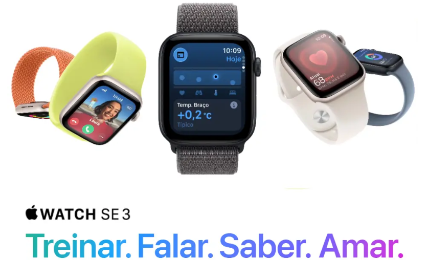

# Smartwatch IoT — Apple Watch SE 3

> **Trabalho Final — Fundamentos de Sistemas Embarcados 2026/1** · Reprodução com ESP32 do produto apresentado pelo grupo no Trabalho 2: um smartwatch IoT vestível que monitora frequência cardíaca e movimento, exibindo informações locais em tela OLED e integrando telemetria e controle por RPC via ThingsBoard.

<p align="center">
  
  
  
  
</p>

<p align="center">
  
  
</p>

## Participantes do Grupo

<div align="center">

| Matrícula | Nome completo |
|:---------:|---------------|
| 211062240 | Mateus Bastos dos Santos |
| 180116746 | Arthur Heleno do Couto da Silva |
| 180066161 | Luis Henrique Luz Costa |
| 180113097 | Daniel Coimbra dos Santos |

</div>

---

## 1. Descrição do Produto

O **Smartwatch IoT** é um dispositivo vestível de saúde e segurança — inspirado no **Apple Watch SE 3** — composto por um **sensor analítico de frequência cardíaca (KY-039)**, uma **IMU MPU6050** para detectar aceleração tridimensional e incidentes de movimento brusco, um **buzzer ativo** para alertas acústicos locais e uma **tela OLED SSD1306** para visualização local. Em vez do ecossistema fechado da Apple, ele publica dados de telemetria via **Wi-Fi/MQTT** na plataforma **ThingsBoard**, exibindo métricas dinâmicas em tempo real e permitindo comandos remotos.

<p align="center">
  
</p>
<p align="center"><em>Figura 1: produto de referência — Apple Watch SE 3</em></p>

O problema que o produto resolve é permitir o **monitoramento contínuo e não-invasivo de sinais vitais e segurança de pessoas** (como idosos ou atletas), emitindo alarmes imediatos localmente em caso de arritmia ou quedas, ao mesmo tempo em que disponibiliza esses dados remotamente para cuidadores em uma interface web unificada.

### O que foi reproduzido em relação ao Trabalho 2

**Reproduzido integralmente:**

- **Monitoramento Cardíaco (BPM):** Leitura via pino analógico do sensor de pulso KY-039 acoplado ao ADC1 (GPIO 34) com filtro digital IIR e detector dinâmico de picos.
- **Detecção de Movimento Brusco:** Magnitude de aceleração `|a| = √(ax² + ay² + az²)` lida via acelerômetro MPU6050 (I2C) para monitorar impactos maiores que 2,5 G.
- **Interface Local em OLED:** Tela OLED SSD1306 (128x64 pixels) via I2C compartilhado, exibindo Watchface (hora, data, status de rede), Health Metrics (BPM, G, quedas) e a tela de SOS.
- **Navegação Integrada:** Mudança de telas por giro de Rotary Encoder com suporte a interrupção física e seleção pelo botão integrado (SW).
- **Alerta de SOS Manual:** Disparo de SOS ao pressionar e segurar o botão físico (GPIO 4) por mais de 3 segundos, acionando o buzzer local e alertando o dashboard.
- **Conectividade Wi-Fi e MQTT:** Conexão wireless e telemetria estruturada em JSON enviada ao ThingsBoard.

**Adicionado/estendido nesta versão (além do escopo do T2):**

- **Fallback de Simulação (IMU):** Caso a IMU física falhe ou não responda via I2C, o firmware executa uma simulação dinâmica que gera um ruído de repouso em torno de 1,0 G e insere um pico de 2,8 G a cada 15 segundos para validar e testar os alertas do painel web.
- **RPC Bidirecional Completo:** Processamento de comandos remotos ThingsBoard (método `"buzzer"`) no callback do MQTT, permitindo acionar alarmes sonoros customizados remotamente.
- **Alerta Crítico Instantâneo:** Lógica de alarme de batimento cardíaco configurada para disparar o buzzer e setar a flag de emergência no ThingsBoard imediatamente ao ler valores fora de [50, 120] BPM (bradicardia e taquicardia).
- **100% C++ em ESP-IDF Puro:** Uso de tasks FreeRTOS, drivers nativos (`driver/gpio.h`, `driver/i2c.h`, `esp_adc/adc_oneshot.h`) e compilação local da biblioteca `esp-mqtt` para contornar problemas de caracteres Unicode no compilador de caminhos do Windows.

---

## 2. Arquitetura da Solução

O sistema segue uma arquitetura em camadas, do hardware vestível ao ThingsBoard:

```mermaid
graph TD
    subgraph Wearable ESP32 (Hardware & Firmware)
        S1[Sensor KY-039 - ADC] -->|PPG Signal| T_Sensors[sensorTask - Core 1]
        S2[MPU-6050 - I2C] -->|Accel ax,ay,az| T_Sensors
        T_Sensors -->|Mutex Write| State[AppState Shared RAM]
        
        T_UI[uiTask - Core 0] -->|Mutex Read| State
        T_UI -->|Encoder SW & GPIO 4| Inputs[Inputs Debounce]
        T_UI -->|I2C Command| OLED[OLED SSD1306 Display]
        T_UI -->|Bip Sequence| Buzzer[Buzzer Alarme]
        
        T_Network[networkTask - Core 0] -->|Mutex Read/Consume| State
        T_Network -->|Publish WiFi/MQTT| WiFi[Driver STA / esp-mqtt]
    end
    subgraph Cloud IoT
        WiFi -->|JSON Telemetry| TB[ThingsBoard Dashboard]
        TB -->|Remote RPC commands| WiFi
    end
```

### 2.1. Estrutura FreeRTOS

Todo o firmware foi desenvolvido em **ESP-IDF** nativo e é coordenado por três tasks FreeRTOS assíncronas com afinidade a núcleos e prioridades otimizadas:

<div align="center">

| Task | Responsabilidade | Período / Taxa | Prioridade | Core |
|------|------------------|:--------------:|:----------:|:----:|
| `sensors` (`sensorTask`) | Amostragem de picos do sinal PPG do KY-039 e leituras de aceleração linear da IMU MPU6050 | 2 ms (500 Hz) | 2 | 1 |
| `ui` (`uiTask`) | Leitura de botões (debounce), processador do Rotary Encoder, controle temporizado do buzzer e renderização local do OLED | 100 ms (10 Hz) | 1 | 0 |
| `network` (`networkTask`) | Gerenciamento de eventos de rede Wi-Fi, publicação MQTT e despacho de telemetria | 200 ms (5 Hz) | 1 | 0 |

</div>

**Mecanismos de sincronização e comunicação entre tasks:**

- **Mutex de Estado Compartilhado (`app_state.cpp`):** A leitura e a escrita das variáveis globais da struct `AppState` (BPM, Magnitude G, status das flags de alarme e da tela ativa) são isoladas por um Mutex do FreeRTOS, garantindo leitura e gravação thread-safe entre núcleos.
- **Spinlocks de Hardware (Encoder):** A leitura física de giros do encoder é tratada via interrupção (ISR) de GPIO no pino CLK (GPIO 18), alterando de forma assíncrona a variável `g_encoder_delta`. O acesso a esta variável na `uiTask` é sincronizado através do spinlock SMP `portENTER_CRITICAL()` para impedir race conditions.
- **Heartbeat e Envio por Demanda:** A telemetria é despachada periodicamente a cada 10 segundos. Contudo, ao acionar o SOS ou detectar movimento brusco, a função `appStateRequestPublish()` sinaliza `publishNow` no estado e a `networkTask` envia os dados imediatamente à nuvem.

---

### 2.2. Sensores e Atuadores (Entradas e Saídas)

Pinagem conforme arquivos de hardware configurados em `include/config.h`:

<div align="center">

| Componente | Tipo (Entrada/Saída) | Pino(s) ESP32 | Função no produto |
|------------|----------------------|---------------|-------------------|
| **KY-039 (Batimento)** | Entrada (analógica) | GPIO 34 (ADC1_CH6) | Leitura do sinal infravermelho PPG para cálculo de frequência cardíaca. |
| **IMU MPU6050 (Acelerômetro)** | Entrada (I2C) | SDA: **21** / SCL: **22** | Leitura de aceleração linear para identificar quedas. |
| **OLED 0,96" (SSD1306)** | Saída (I2C) | SDA: **21** / SCL: **22** | Exibe hora, data, BPM, magnitude de aceleração e SOS localmente. |
| **Rotary Encoder (CLK)** | Entrada (digital + IRQ) | GPIO 18 | Interrupção externa de descida para incremento de rotação. |
| **Rotary Encoder (DT)** | Entrada (digital) | GPIO 19 | Sentido de rotação do encoder. |
| **Encoder Botão (SW)** | Entrada (digital) | GPIO 23 | Botão de seleção (seleciona/confirma nos submenus). |
| **Botão SOS / Navegação** | Entrada (digital) | GPIO 4 | Clique curto avança de tela. Clique longo (>= 3s) ativa o SOS. |
| **Buzzer Ativo** | Saída (digital) | GPIO 25 | Avisos acústicos de segurança de taquicardia, bradicardia, queda e SOS Morse. |

</div>

---

## 3. Comunicação Wireless

A comunicação do smartwatch utiliza a pilha nativa do ESP-IDF no modo **Wi-Fi Station (STA)** com conexões automáticas e event handlers no loop de rede para lidar com quedas e reconexão automática em segundo plano.

### 3.1. Integração com ThingsBoard / MQTT

O cliente MQTT local autentica no broker ThingsBoard informando o **Access Token** do device como username, operando nos seguintes tópicos da plataforma:

<div align="center">

| Canal | Tópico | Direção |
|-------|--------|:-------:|
| Telemetria | `v1/devices/me/telemetry` | ESP32 ➡️ ThingsBoard |
| RPC (recebimento) | `v1/devices/me/rpc/request/+` | ThingsBoard ➡️ ESP32 |
| RPC (resposta) | `v1/devices/me/rpc/response/<request_id>` | ESP32 ➡️ ThingsBoard |

</div>

**Telemetria:** O payload estruturado em JSON com as chaves snake_case mapeadas é enviado periodicamente ou em pânico:
```json
{
  "heart_rate_bpm": 72.5,
  "heart_rate_alert": false,
  "accel_magnitude_g": 1.02,
  "rapid_motion_alert": false,
  "sos_triggered": false,
  "sos_manual": false,
  "screen": "watchface",
  "uptime_s": 3600
}
```

**RPC (comandos remotos):**
*   **`buzzer`:** Recebe um comando com parâmetro de milissegundos `{"params": duration}`. O smartwatch soa o buzzer de teste por esse período e responde no tópico de resposta correspondente com o payload `{"success":true}`.

---

## 4. Como Compilar e Executar

### 4.1. Pré-requisitos
- **ESP-IDF v6.0.1** instalado e exportado no PATH do terminal.
- Placa ESP32 DevKit montada e conectada ao computador.

### 4.2. Configuração
Copie o arquivo de exemplo para criar o cabeçalho secreto local do firmware:
```bash
cp include/secrets.h.example include/secrets.h
```

Configure suas credenciais no arquivo [include/secrets.h](file:///X:/include/secrets.h):
```cpp
#define WIFI_SSID "Wokwi-GUEST"
#define WIFI_PASSWORD ""
#define TB_ACCESS_TOKEN "v1p4g0cr_s1m_trabalho"
#define TB_MQTT_HOST "demo.thingsboard.io"
#define TB_MQTT_PORT 1883
```

### 4.3. Compilação e Gravação
Com o terminal configurado, compile e grave o binário usando o CMake/Ninja integrado ao ESP-IDF:

```bash
# Configura o target para ESP32
cmake -G Ninja -B build

# Compila o binário smartwatch.bin
ninja -C build

# Grava na ESP32 (substitua <PORTA> pela porta COM do Windows ou ttyUSB do Linux)
esptool.py --chip esp32 -p <PORTA> write_flash -z 0x10000 build/smartwatch.bin
```

### 4.4. Configuração do ThingsBoard
1. Crie um dispositivo do tipo **MQTT** no seu ThingsBoard.
2. Copie o **Access Token** gerado nas credenciais do device e cole no arquivo `secrets.h`.
3. Com a ESP32 conectada (LED azul/verde indicando online), certifique-se de que a telemetria JSON é recebida na aba *Latest telemetry*.
4. Importe o dashboard JSON configurado para exibir gráficos de BPM, magnitude de aceleração linear, status de alerta crítico e SOS.

---

## 5. Estrutura do Código

```text
X:\
├── CMakeLists.txt              # Script de compilação CMake raiz
├── platformio.ini              # Configurações de suporte para o PlatformIO
├── sdkconfig                   # Kconfig com opções da ESP-IDF
├── include/                    # Diretório de Cabeçalhos
│   ├── app_state.h             # Estado sincronizado do smartwatch
│   ├── buzzer.h                # Máquina de estados do alarme acústico
│   ├── config.h                # Definição de GPIOs e timers do hardware
│   ├── display_ui.h            # Renderização de fontes SSD1306 e layouts
│   ├── heart_rate.h            # ADC oneshot e processamento do KY-039
│   ├── imu_sensor.h            # Driver I2C do MPU-6050
│   ├── inputs.h                # Tratamento do Rotary Encoder e botões
│   ├── network.h               # Loop de eventos Wi-Fi Station e MQTT
│   ├── secrets.h               # Credenciais de conexão (gerado a partir de secrets.h.example)
│   └── (headers esp-mqtt...)   # Arquivos de cabeçalho da biblioteca MQTT local
└── src/                        # Código Fonte (.cpp e .c)
    ├── CMakeLists.txt          # Fontes e dependências registradas
    ├── main.cpp                # app_main e tasks do FreeRTOS
    ├── app_state.cpp           # Armazenamento e lock de Mutex do estado
    ├── buzzer.cpp              # Temporização não-bloqueante do buzzer
    ├── display_ui.cpp          # Fonte de texto 5x7 e buffer I2C
    ├── heart_rate.cpp          # Algoritmo de filtro e BPM do KY-039
    ├── imu_sensor.cpp          # Leitura do acelerômetro e lógica de fallback
    ├── inputs.cpp              # ISR do encoder e debounce de botões
    ├── network.cpp             # Máquina de Wi-Fi/MQTT e processamento RPC
    └── (código esp-mqtt...)    # Fontes C do cliente MQTT local
```

---

## 6. Vídeo de Demonstração

O vídeo contendo a demonstração de funcionamento de cada driver, transição de telas através do encoder rotativo, detecção de movimento brusco e envio de telemetria no ThingsBoard está disponível no link abaixo:

*   🎥 **Link do vídeo:** [adicionar link do vídeo aqui]

---

## 7. Referências

- [ESP-IDF Programming Guide — ESP32](https://docs.espressif.com/projects/esp-idf/en/latest/esp32/)
- [ThingsBoard MQTT API Reference](https://thingsboard.io/docs/reference/mqtt-api/)
- [MPU-6050 Register Map and Datasheet (InvenSense)](https://invensense.tdk.com/wp-content/uploads/2015/02/MPU-6000-Register-Map1.pdf)
- [SSD1306 Display Controller Datasheet](https://cdn-shop.adafruit.com/datasheets/SSD1306.pdf)
